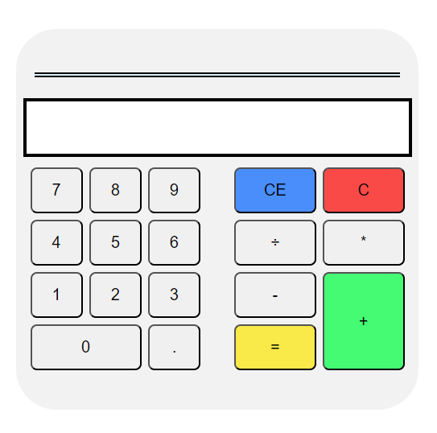

<header style='text-align: center'>
    <h1 style= 'font-size: 70px'> Calculadora - Orientação a Objetos com JavaScript </h1>
</header>

<!-- ======================== -->
# Índice
<ul style='display: grid; '>
   <li><a href='#Tecnologia-utilizadas-no-projeto'>Tecnologia</a></li>
   <li><a href='#Caracteristicas'>Caracteristicas</a></li>
   <li><a href='#Serviços-usados'>Serviços usados</a></li>
   <li><a href='#Imagens-do-projeto'>Imagens do projeto</a></li>
</ul>

<!-- ======================== -->

# Descrição do projeto

Refazendo projeto da calculadora para praticar Orientação a Objetos com JavaScript.

 

<!-- ======================== -->
# Link Para o Projeto
<a href='https://relaxed-eclair-1ff034.netlify.app/'>Projeto</a>

<!-- ======================== -->

# Tecnologia utilizadas no projeto
<ul style='padding: 0; ' >
    <li style='display: flex; list-style: none; gap: 4px'>
        <a href='https://developer.mozilla.org/pt-BR/docs/Web/HTML'>HTML</a>
    </li>
    <li style='display: flex;  list-style: none; gap: 4px; margin-bottom: 4px'>
        <a href='https://developer.mozilla.org/pt-BR/docs/Web/JavaScript'>JavaScript</a>
    </li>
    <li style='display: flex; list-style: none; gap: 4px; margin-bottom: 4px'>
        <a href='https://developer.mozilla.org/pt-BR/docs/Web/CSS'>CSS</a>
    </li>
</ul>

<!-- ======================== -->

# Serviços usados

    <a href='https://app.netlify.com/'>Netlify</a>

 
<!-- ======================== -->

# Caracteristicas 

Realizar operações de somar, subtração, divisão e multiplicação,
podendo inserir dados utilizando o teclado ou apertando os botões na tela

<!-- ======================== -->

# Imagens do projeto

</img>
</img>

